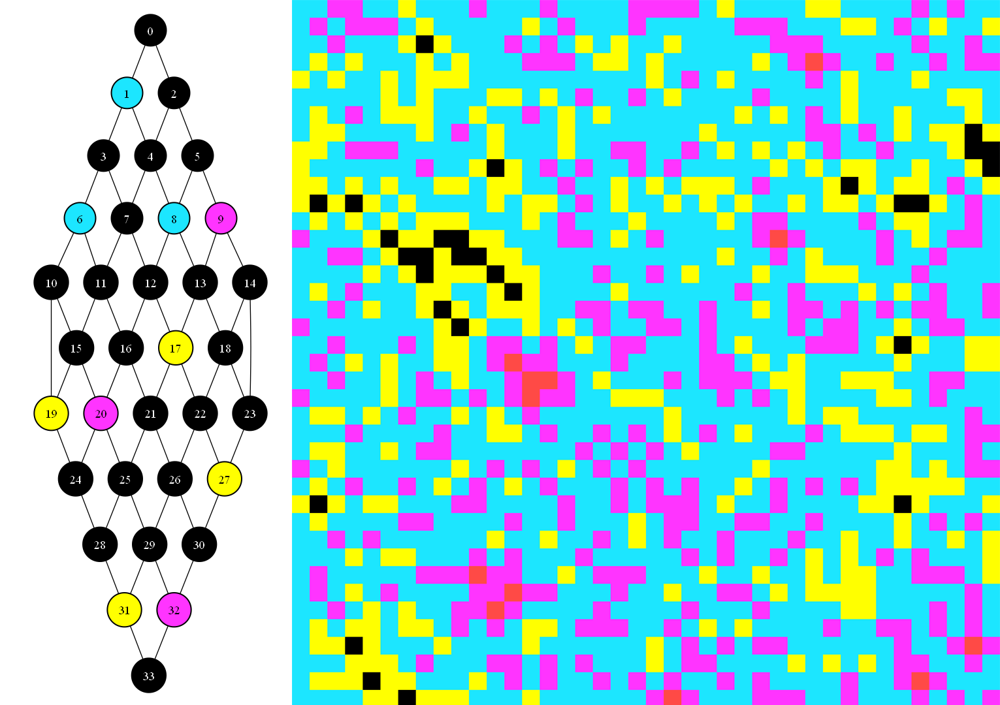
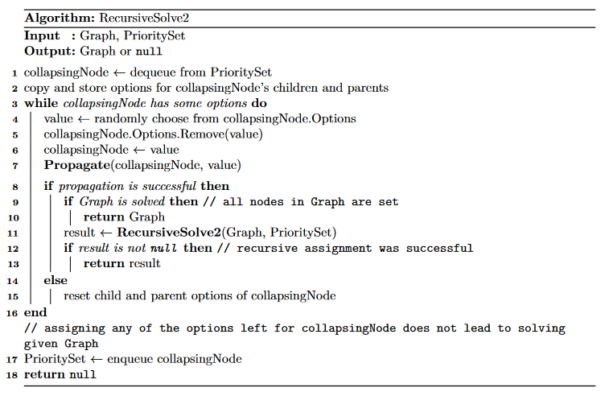
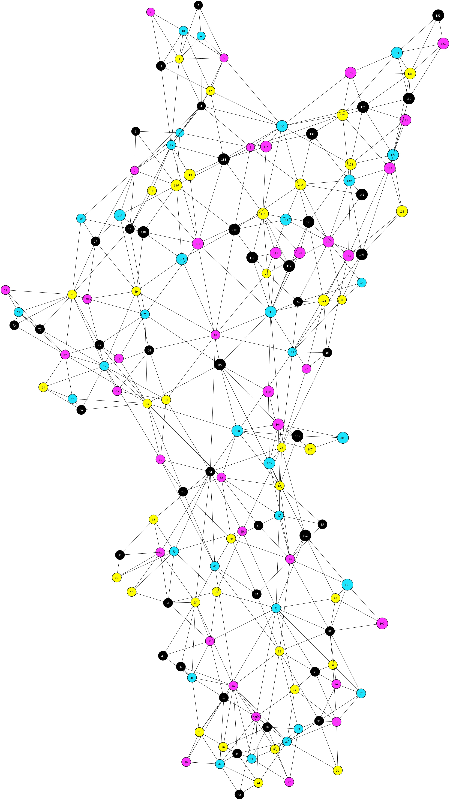
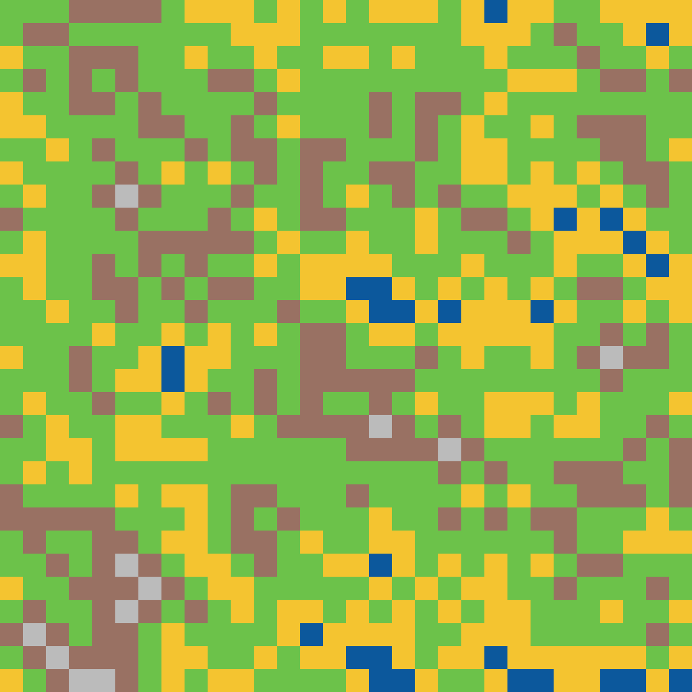
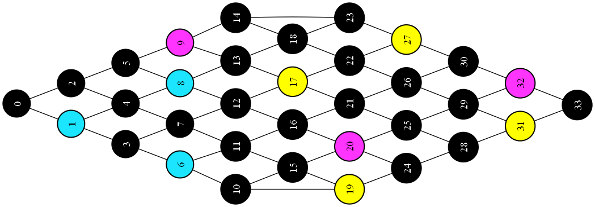
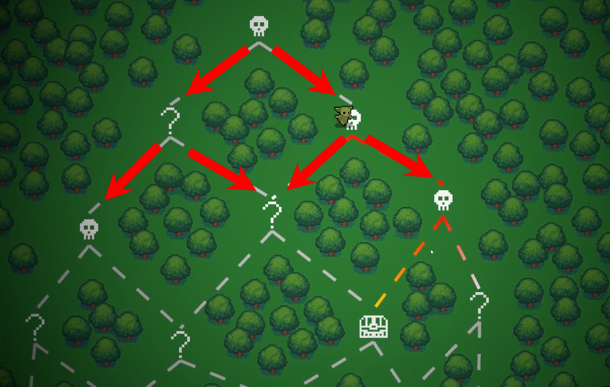
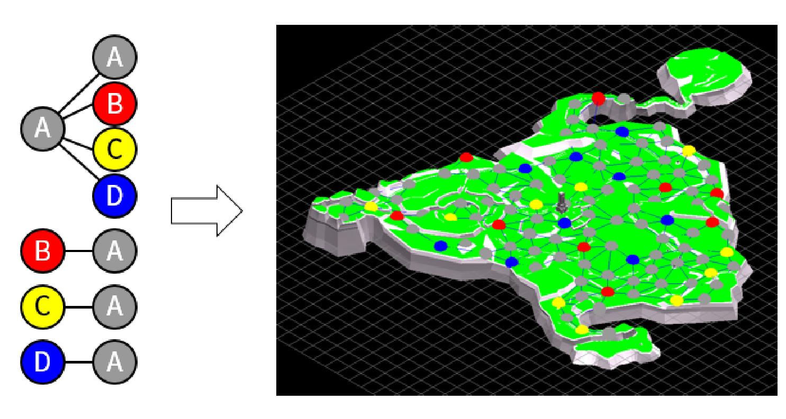
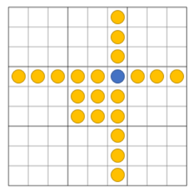
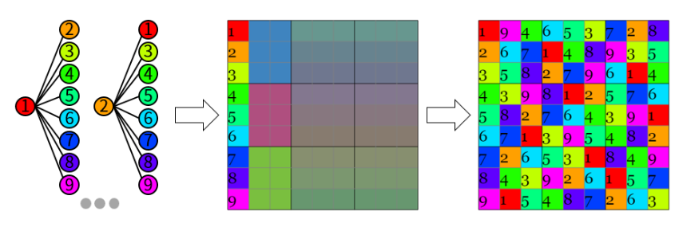

<!-- omit in toc -->
# Graphbased Wavefunction Collapse

GBWFC is a C# library that provides algorithms to create general un/directed graphs and color them based on given rules and color frequencies.

Few usage examples are provided, they are a great source for learning how to use the library in practice. Deep dive into the inner workings of this library is [here (pdf)](docs/tech_docs.pdf).



## Graph representation

The library contains it own classes to represent a Graph and its Nodes. Method to convert graphs from `QuikGraph` is provided.

Methods to save graphs to the DOT format and render them using the GraphViz library are implemented.

## Rules

Rules are relationships between a parent node and its children. For example we can define a rule `(0, [ 1, 2, 3 ])` - if a node has assigned color `0` then its children are allowed to be colored `1`, `2` or `3`.

Rules can be loaded from a JSON by calling `RulebookParser.RulesFromJSON` method. Format example:

```json
{
    "0": [ "0", "1", "2", "3" ],
    "1": [ "0" ],
    "2": [ "0" ],
    "3": [ "0" ]
}
```

## Solver

Recursively tries to meet all the rules and assign values to all of its nodes, returns Graph with assigned colors, if successful or `null`, if it fails.

The main algorithm is called `RecursiveSolve2`:



Nodes are collapsed in order by their Entropy, by default it's [Shannon Entropy](https://en.wikipedia.org/wiki/Entropy_(information_theory)), but user specify any delegate when initializing the Solver, which is then used instead of the default one.

## Constraints

Imagine you are given a Sudoku problem, you don’t start with an empty grid, rather with some of the values filled in - let’s call them constraints aka "the cells set before any solving takes place".

These constraints can be passed to the Solver that takes them into count.

## Example usage

### Graph Coloring

The base Solver is used to get the coloring and then methods `CreateImage` and `ShowImage` are used to render and show the
result.



### Grid Generation

The wrapper for grids generates all the necessary edges which are then used to construct an undirected graph and passed to the Solver. We can define a "country gradient": water, sand, grass, dirt and rocks; and end up with a really simle and stupid Minecraft-like terrain generator.



### Sudoku

The wrapper generates all the necessary edges for all cells and also retrieves constraints from the problem given. This information is then used to create a graph that is passed to the base Solver with retrieved constraints.

```
0 0 0 5 0 9 0 0 4           8 7 3 5 2 9 1 6 4
0 2 0 0 6 0 5 0 9           1 2 4 7 6 3 5 8 9
0 0 9 1 4 8 0 3 0           5 6 9 1 4 8 2 3 7
0 0 0 4 0 0 0 0 0           2 1 6 4 5 7 3 9 8
4 0 0 0 9 0 0 0 0    ==>    4 3 5 8 9 1 7 2 6
0 0 0 0 0 0 0 1 5           7 9 8 2 3 6 4 1 5
0 8 0 0 0 0 9 5 0           3 8 1 6 7 4 9 5 2
0 4 2 0 0 0 8 0 0           6 4 2 9 1 5 8 7 3
0 0 0 0 0 0 6 4 1           9 5 7 3 8 2 6 4 1
```

Classes and methods to request new random boards from [sugoku.onrender.com](https://sugoku.onrender.com/) are provided.

### Map Generation

Inspired by the game [Peglin](https://store.steampowered.com/app/1296610/Peglin/), I created a simple map generator and came up with some rules and frequencies. The map grows from one node into maximal width and then in  collapses back into one node at the end.

There are four types of levels: normal fight (black), boss fight (yellow), shop (blue), treasure (purple); with frequencies `[10, 5, 2, 2]`. The player can only progress downwards, so the graph is oriented. Also we can use pass a constraint to the Solver so that the player starts in a normal fight.

The output, player would progress from left to right:



## Motivation

### Features of a typical WFC implementation

WFC implementations available online are mostly limited to square grids and rules that are symmetric. With a bit of exaggeration, we could say that the standard implementations can handle coloring planar graphs. (For me, it's best to think of WFC as coloring graphs with extra steps.)

The rules are specified as `A-B`, that is, `A` can be adjacent to `B`.

### Why isn't that enough?

In two years of studying CS in college, I found out that not all problems can be reduced to a square grid.

#### Symmetry problems of rules

In the game [Peglin](https://store.steampowered.com/app/1296610/Peglin/), after each battle, the player has a choice between two other options. And since the player cannot backtrack, the map is a DAG - **oriented** graph.



Suppose we want the player to have the option to restock ( :moneybag: ) after each boss ( :skull: ). But we certainly don't want the player to restock before the boss - the rule is not symmetric. We express it as :skull: `->` :moneybag:, typical WFC doesn't account for this, we don't have the option of specifying non-symmetric rules. (Some implementations of WFC retrieve rules out of the example image, such rules are inherently symmetric.)

More complex game level constructions might look like this:



#### Neighborhood problems

Of course, graphs can be significantly more complex, for example with cycles. Sometimes you need to express dependencies between cells that are not neighbors in the square grid. GBWFC can be used to solve Sudoku, where although the rules are symmetric, not all dependent cells are adjacent to each other.

A cell has only four neighbors in the grid, but according to the sudoku rules it depends on a column, a row and a 3x3 square. We could barely contain that in a square grid.





Another example would be coloring a map, cool, the world map is a planar graph after all, so it's easy and we can even do it with just four colors! The opposite is true, what about such exclaves and enclaves? For example, Kaliningrad and mainland Russia should have the same color on the map, even though they are two cells separated by different cells. If more such problems come together, we may not be able to keep track of them.


> according to a comment on [Reddit](https://www.reddit.com/r/MapPorn/comments/ilsfug/4_color_theorem_applied_to_europe/) this map is not quite right, for illustration purposes it will suffice

From these considerations, we can clearly see that the best would be to have an algorithm that works on an arbitrary oriented graph - any other problem we can convert to it.

#### Why not use the conventional graph coloring algorithm?

One of the advantages of WFC is that we can specify in advance how often each cell type (color) should appear. For example, rooms with bosses shouldn't be frequent, you can't tell that just from the rules, so we pass probabilities/numbers to WCF at the beginning (e.g. `normal : 80, boss : 15, treasure : 5`). The standard implementation of coloring doesn't do that.

## Dependencies

- DotNetGraph
- QuickGraph
- Refit
- System.Drawing.Common

## References

1) [Automatic Generation of Game Content using a Graph-based Wave Function Collapse Algorithm](https://ieeexplore.ieee.org/document/8848019), by Hwanhee Kim, Seongtaek Lee, Hyundong Lee, Teasung Hahn, Shinjin Kang

2) [The Wavefunction Collapse Algorithm explained very clearly](https://robertheaton.com/2018/12/17/wavefunction-collapse-algorithm/), by RObert Heaton

## Acknowledgements

1) `ContrastColor` at `DistinctColors.cs`
   - Returns a more contrastive option for text for a given background (black or white).
   - by [Gacek](https://stackoverflow.com/users/177167/gacek), found at [Stack Overflow](https://stackoverflow.com/questions/1855884/determine-font-color-based-on-background-color)

2) Precomputed list of contrast colors at `DistinctColors.cs`

   - List of 1024 precomputed contrast colors, used for contrast-enough graph coloring.
   - by [Tatarize](https://stackoverflow.com/users/631911/tatarize), found at [Stack Overflow](https://stackoverflow.com/questions/309149/generate-distinctly-different-rgb-colors-in-graphs)

3) `PrioritySet<TElement, TPriority>` with updates at `PriorityQueue.cs`

   - Returns element with lowest priority, supports updates to already enqueued elements in $O(\log n)$.
   - by [eiriktsarpalis](https://github.com/eiriktsarpalis/), proposed [here](https://github.com/dotnet/runtime/issues/44871)

4) Many thanks to my friend [Matej](https://github.com/mvolfik) who helped me to debug the Solver.
