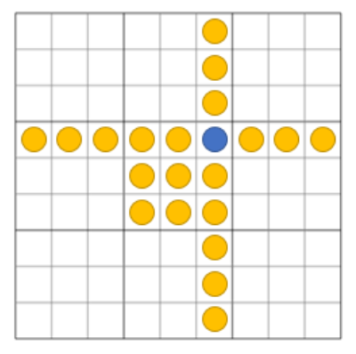

---
header-includes:
  - \usepackage[ruled,vlined,linesnumbered]{algorithm2e}
geometry: margin=3cm
---

<!-- omit in toc -->
# Graphbased Wavefunction Collapse - Technical Documentation

> **Disclaimer**: This overview primarily explains the reasoning behind various implementation decisions. Additionally, I share some of my visions for the project's future development. This documentation is intended to be read alongside the code itself, as the most important methods are accompanied by their own comments inside the source files.

- [Graph representation](#graph-representation)
- [Rulebook](#rulebook)
- [Solver](#solver)
- [Wrappers](#wrappers)
- [Dependencies](#dependencies)
- [References](#references)
- [Acknowledgements](#acknowledgements)


# Graph representation

The graph representation used (named `WFCGraph`) is a List of `Node`s, the graph keeps and updates its number of total nodes set (node "is set" when any non-negative number has been assigned to it). Every `Node` has two Lists filled with other nodes: Parents and Children, these are a subset of other nodes in the graph.

This representation ensures quick access to the parents and children of a given node, eliminating the need to search through a list or set of edges.

Every node has its own ID that is assigned to it when the graph is being constructed. When given a graph with $N$ nodes, the IDs range from $0$ to $N-1$. Indexing with $M$ to `WFCGraph.AllNodes` (all nodes are stored here) returns a node with ID equal to $M$.

Graph constructors create new `Node`s and then build relationships between them.

## Edges

`Edge` is a struct with two fields: Parent and Child. Meaning that, if the graph is directed, the edge goes from Parent to Child.

## Loading graph from a file

A graph can be loaded from a file using the static method `WFCGraph.ParseEdgesFromFile`. Every edge has to be on its own line written as two numbers with a single space between them: `A B` this will be interpreted as `Edge(Parent: A, Child: B)`.

Edges do not have to be in any particular order. When representing an undirected graph, use only a single line to represent an undirected edge: "`A B`", the file should **not** contain an edge "`B A`". Note that a graph with $N$ nodes has to be represented by edges with `A` and `B` between $0, N-1$.

## Example

```
0 1
0 2
0 4
1 2
...
```

## Graph directedness

Information about graph's directedness is used in its constructors. User passes a list of `Edge`s and they are then interpreted either as directed or as undirected. When edge `(A,B)` interpreted is directed the algorithm adds `A` as a parent of `B` and `B` as a child of `A`, when interpreted as undirected the same is repeated but with `(B,A)`.

## GraphConverter

A basic converter for graphs from the `QuikGraph` library to `WFCGraph` is provided. The method returns a new `WFCGraph` and also a mapping of `QuikGraph`'s Vertices to `WFCGraph`'s Nodes.

Keep in mind that this method is as general as it can get, it does not use any tricks for specific graph representation provided by `QuikGraph`.
It takes some (precious) time to convert between the two graphs. Constructing `WFCGraph` from a list of edges is the preferred way to go.

# Rulebook

Rulebook is a collection of rules that, when queried by a node type (color) returns a single `Rule`. It has two arrays of rules, one for the relationships between a parent and children (that is passed to a constructor by the user) and one for the relationships between a child and parents (that is created automatically during initialization).

This way, when assigning a value $M$ to a node $K$, we can easily retrieve rule for children using `rulesForChildren[`$M$`]` and rule for parents using `rulesForParents[`$M$`]`, and update options of $K$'s neighbors accordingly.

## Rule

`Rule` is a description of a relationship between a parent node and its children represented by a struct with two fields: Item and Options. Item is the value assigned to parent and Options are all allowed values for its children.

In this example set of rules in \ref{rules}, there are four types (colors) of nodes `A`, `B`, `C` and `D`. `A` can have any type as its children, `B` and `D` can have only `A` as their child, and `C` must have `D` as a child.

Here we can see the strength of oriented rules: after every `C` there has to be `D` and it can't be the other way around. Maybe we want the player to go through level `D` only after he passes level `C`. See \ref{map} for an example of an oriented graph colored like this.

{ width=50% }

## Loading rules from a file

The rules from \ref{rules} can be represented as a JSON and retrieved by calling `RulebookParser.RulesFromJSON`, it uses the `System.Text.Json` library.

```json
{
  "0": [ "0", "1", "2", "3" ],
  "1": [ "0" ],
  "2": [ "3" ],
  "3": [ "0" ]
}
```

Note if there are $N$ types of nodes, then there must be rules with types from $0$ to $N-1$.

# Solver

The heart of this whole project is the Solver, a wave function collapse implementation for general graphs.

The Solver is initialized with a `Rulebook`, optional `globalWeights` and `evaluateNode`.

`globalWeights` is an array of type frequencies, the higher the number at index $M$, the higher to probability that type $M$ will randomly chosen (when assigning values to nodes). If no array is given, the frequencies are initialized as a list of ones (for example, in solved Sudoku all numbers have the same frequency).

`evaluateNode` is a method (`EvaluateNode` is a delegate, a template if you will) that, when given a node and `globalWeights`, calculates node's entropy. Users are able to define their own methods for node evaluation.

```cs
public delegate double EvaluateNode(IEnumerable<int> nodeOptions,
                                    IReadOnlyList<int> globalWeights);
```

## Shannon Entropy - the default

The Shannon Entropy of a given node can be calculated as:

$$
\text{H}(X) := - \sum_{i = 1}^{n} p(x_i) \log p(x_i)
$$

where $p(x_i)$ is the probability of outcome $x_i$.

After few updates to node's options, some of the types may not be valid, so their probability is zero and all other probabilities have to be scaled accordingly. Method that does this is already implemented as `ConvertWeights`, it can be used in other user-defined methods.

\renewcommand{\thealgocf}{}
\begin{algorithm}[H]
\caption{ShannonEntropy}
\DontPrintSemicolon
\SetAlgoLined
\SetNoFillComment
\SetKwInOut{Input}{Input}\SetKwInOut{Output}{Output}
\Input{Node.Options, GlobalWeights}
\Output{\texttt{double}}
\BlankLine
\tcp*[h]{get sum of frequencies of valid options}\;
total $\leftarrow$ 0\;
\ForEach{option in Node.Options}{
    total $\leftarrow$ total + GlobalWeights[option]\;
}
\BlankLine
\tcp*[h]{normalize the probabilities}\;
probabilities $\leftarrow$ []\;
i $\leftarrow$ 0\;
\ForEach{option in Node.Options}{
    probabilities[i] $\leftarrow$ GlobalWeights[option] / total\;
    i $\leftarrow$ i + 1\;
}
\BlankLine
\tcp*[h]{the actual Shannon Entropy calculation}\;
entropy $\leftarrow$ 0\;
\ForEach{prob in probabilities}{
    entropy $\leftarrow$ entropy - (prob $\times$ $\log$(prob))\;
}
\textbf{return} entropy\;
\end{algorithm}

## PrioritySet

For quick enqueueing and dequeueing of nodes to process the algorithm uses a `PrioritySet` implemented by [eiriktsarpalis](https://github.com/eiriktsarpalis), [here](https://github.com/eiriktsarpalis/pq-tests/blob/master/PriorityQueue/PrioritySet.cs). The structure allows updates to the priority of nodes in $O(\log N)$ and does not allow duplicates.

Working with it is similar to C#'s basic PriorityQueue, the ability to update already enqueued elements is the only difference.

## Constraints

Imagine you are given a Sudoku problem, you don't start with an empty grid, rather with some of the values filled in - let's call them constraints aka "the cells set before any solving takes place".

List of constraints can be passed to the Solver, there are two ways how to represent a constraint: by a reference to a node itself or by node ID (the latter gets converted to a list of references). For this purpose two structs are implemented `ConstraintByNode` and `ConstraintById` both with two fields: node specification and the ForcedValue.

When applying constraints, the Solver propagates these choices as if it was a normal value assignment. The calculation time is significantly shorter than if we would only assign the values without propagation.

## Main algorithms and methods

### Solve Method

\renewcommand{\thealgocf}{}
\begin{algorithm}[H]
\caption{Solve}
\DontPrintSemicolon
\SetAlgoLined
\SetNoFillComment
\SetKwInOut{Input}{Input}\SetKwInOut{Output}{Output}
\Input{Graph, Constraints, GlobalWeights}
\Output{Graph or \texttt{null}}
\BlankLine
\tcp*[h]{initialize options for every Node in Graph}\;
\ForEach{Node in Graph's nodes}{
    Node.Options $\leftarrow$ [$0,1,2, ..., N-1$]
}
\BlankLine
\tcp*[h]{apply constraints}\;
\ForEach{Constraint(Node, ForcedValue) in Constraints}{
    Node $\leftarrow$ ForcedValue\;
    \textbf{Propagate}(Node, ForcedValue)\;
}
\BlankLine
\tcp*[h]{initialize PrioritySet}\;
\ForEach{Node in Graph's nodes}{
    PrioritySet $\leftarrow$ enqueue (Node, \textbf{EvaluateNode}(Node, GlobalWeights))\;
}
\textbf{return} \textbf{RecursiveSolve2}(Graph, PrioritySet)
\end{algorithm}

### RecursiveSolve2 Algorithm

\renewcommand{\thealgocf}{}
\begin{algorithm}[H]
\caption{RecursiveSolve2}
\DontPrintSemicolon
\SetAlgoLined
\SetNoFillComment
\SetKwInOut{Input}{Input}\SetKwInOut{Output}{Output}
\Input{Graph, PrioritySet}
\Output{Graph or \texttt{null}}
\BlankLine

collapsingNode $\leftarrow$ dequeue from PrioritySet\;
copy and store options for collapsingNode's children and parents\;

\While{collapsingNode has some options}{
    value $\leftarrow$ randomly choose from collapsingNode.Options\;
    collapsingNode.Options.Remove(value)\;
    collapsingNode $\leftarrow$ value\;
    \textbf{Propagate}(collapsingNode, value)\;
    \BlankLine
    \uIf{propagation is successful}{
        
        \uIf(\tcp*[h]{all nodes in Graph are set}){Graph is solved}{
            \textbf{return} Graph\;
        }
        result $\leftarrow$ \textbf{RecursiveSolve2}(Graph, PrioritySet)\;
        \uIf(\tcp*[h]{recursive assignment was successful}){result is not \texttt{null}}{
            \textbf{return} result
        }
    }
    \uElse{
        reset child and parent options of collapsingNode\;
    }
}
\tcp*[h]{assigning any of the options left for collapsingNode does not lead to solving given Graph}\;
PrioritySet $\leftarrow$ enqueue collapsingNode\;
\textbf{return} \texttt{null}\;
\end{algorithm}

# Wrappers

As mentioned before, the implemented algorithm is very versatile and can be used to perform many graph-based calculation. I have already implemented some wrappers for the Solver, that can be an inspiration for others. All of them implement the `ISolver` interface that is quite simple:

```cs
public interface ISolver<T>
{
    public T? Solve(T problem);
}
```

All of these usages have a working code example implemented in the project.

## Graph Coloring

> **Note**: To use this example to its full extend you need to install the [GraphViz](https://graphviz.org/) library (graph drawing engines).
>
> And, technically, this is not a wrapper.

Rulebok has a method `CreateColoringRules(int n)` that returns a list of rules for a set of colors $\mathbf{C}$ such that: $\{(c, \mathbf{C} \setminus c) \mid \forall c \in \mathbf{C} \}$ (every color can be a adjacent to every color except itself). The base Solver is used to get the coloring and then methods `CreateImage` and `ShowImage` are used to render and show the result.

Uses a list of 1024 pregenerated contrastive colors to color the graph using the DOT format and GraphViz to generate final image.

When using the GraphViz engines, use `dot` for any graph where there is any type of hierarchy and `fdp` for anything else.

{ width=50% }

## Grid Generation

> **Note**: I will not be implementing the option to use and apply rules to larger sub-grids of pixels (as [done by mxgmn](https://github.com/mxgmn/WaveFunctionCollapse)) in the nearest feature for two main reasons:
>
>1. It is significantly easier to implement this with an algorithm that operates on grids by default.
>2. This feature has been implemented multiple times before and is not the primary focus of this project. Instead, I prefer to concentrate my efforts on general graphs.

The wrapper for grids generates all the necessary edges which are then used to construct an undirected `WFCGraph`.

As before, the Rulebok has a method `CascadeRules(int n)` that returns a list of rules for a set of color such that color $M$ can be adjacent to colors $M-1, M, M+1$. With this we can define a "country gradient": water, sand, grass, dirt and rocks; and end up with a really simle and stupid Minecraft-like terrain generator as seen in \ref{mcterrain}.

{ width=50% }

## Sudoku

Solving Sudoku is just a more complex graph coloring problem. One cell has more neighbors (relations) than what it may look like from the grid itself.

{ width=50% }

The wrapper generates all the necessary edges (seen in \ref{sudokuneighbors}) for all cells and also retrieves constraints from the problem given. This information is then used to create a `WFCGraph` that is passed to the base Solver with retrieved constraints.

The Sudoku board is represented as `int[9,9]`, for example:

```cs
{
    { 0, 0, 0, 7, 0, 5, 0, 0, 2, },
    { 0, 0, 3, 0, 0, 8, 0, 7, 0, },
    { 0, 0, 0, 0, 0, 0, 0, 0, 0, },
    { 2, 0, 5, 0, 0, 0, 0, 0, 0, },
    { 0, 4, 6, 0, 0, 0, 0, 1, 5, },
    { 0, 0, 0, 0, 0, 0, 0, 0, 0, },
    { 4, 0, 0, 5, 0, 0, 0, 8, 0, },
    { 6, 0, 1, 0, 8, 0, 0, 0, 0, },
    { 8, 7, 9, 6, 2, 0, 0, 5, 0, },
}
```

## Map Generation

When creating a roguelike game one needs to not only generates the levels themselves but also the map which includes the levels. The rules may be strict and in the worse case the graph may include cycles.

Inspired by the game [Peglin](https://store.steampowered.com/app/1296610/Peglin/), I created a simple map generator and came up with some rules and frequencies. The map grows from one node into maximal width and then it collapses back into one node at the end (maps in the game can be much more complicated, but after all, this project is about coloring these maps, not creating them`:)`).

{ width=50% }

There are four types of levels: normal fight (gray), treasure (red), boss fight (yellow), shop (blue); with frequencies `[10, 5, 5, 5]`. The player can only progress downwards, so the graph is oriented. Also we can pass a constraint to the Solver so that the player starts in a normal fight.
The rules are same as in \ref{rules}:

```json
{
  "0": [ "0", "1", "2", "3" ],  // normal fight
  "1": [ "0" ],                 // treasure
  "2": [ "3" ],                 // boss fight
  "3": [ "0" ]                  // shop
}
```

{ width=100% }

\newpage

# Dependencies

- DotNetGraph
- QuickGraph
- Refit
- System.Drawing.Common

# References

1) [Automatic Generation of Game Content using a Graph-based Wave Function Collapse Algorithm](https://ieeexplore.ieee.org/document/8848019), by Hwanhee Kim, Seongtaek Lee, Hyundong Lee, Teasung Hahn, Shinjin Kang

2) [The Wavefunction Collapse Algorithm explained very clearly](https://robertheaton.com/2018/12/17/wavefunction-collapse-algorithm/), by RObert Heaton

# Acknowledgements

1) `ContrastColor` at `DistinctColors.cs`
   - Returns a more contrastive option for text for a given background (black or white).
   - by [Gacek](https://stackoverflow.com/users/177167/gacek), found at [Stack Overflow](https://stackoverflow.com/questions/1855884/determine-font-color-based-on-background-color)

2) Precomputed list of contrast colors at `DistinctColors.cs`

   - List of 1024 precomputed contrast colors, used for contrast-enough graph coloring.
   - by [Tatarize](https://stackoverflow.com/users/631911/tatarize), found at [Stack Overflow](https://stackoverflow.com/questions/309149/generate-distinctly-different-rgb-colors-in-graphs)

3) `PrioritySet<TElement, TPriority>` with updates at `PriorityQueue.cs`

   - Returns element with lowest priority, supports updates to already enqueued elements in $O(\log n)$.
   - by [eiriktsarpalis](https://github.com/eiriktsarpalis/), proposed [here](https://github.com/dotnet/runtime/issues/44871)

4) Many thanks to my friend [Matej](https://github.com/mvolfik) who helped me to debug the Solver.