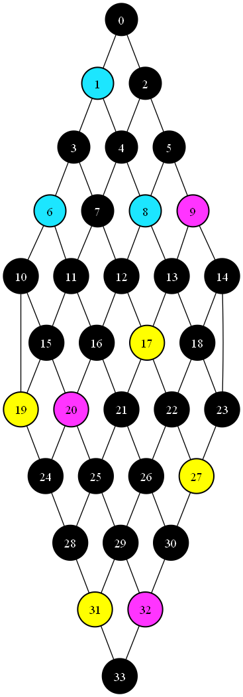

# Examples

The implementation of WFC provided can be applied to anything that can be expressed as a directed graph (and then converted back). That's a lot of options, here are some examples with implemented wrappers around the main GBWFC Solver.

Note that the colors chosen are only for visualization purposes.

## Sudoku

First we generate a graph by considering and edge between every two nodes in every row, column and a 3x3 sub-square. Already set values in given Sudoku are passed to the solver as constraints and they are reflected on while solving.

Rules are really simple because Sudoku is just graph coloring with extra steps - aka every color can be neighbor with every color except with itself. (I ended up writing a method that generates this kind of rules.)

Sudoku board is a `int[9,9]` array.

```cs
new int[,]
{
    { 0, 0, 0, 7, 0, 5, 0, 0, 2, },
    { 0, 0, 3, 0, 0, 8, 0, 7, 0, },
    { 0, 0, 0, 0, 0, 0, 0, 0, 0, },
    { 2, 0, 5, 0, 0, 0, 0, 0, 0, },
    { 0, 4, 6, 0, 0, 0, 0, 1, 5, },
    { 0, 0, 0, 0, 0, 0, 0, 0, 0, },
    { 4, 0, 0, 5, 0, 0, 0, 8, 0, },
    { 6, 0, 1, 0, 8, 0, 0, 0, 0, },
    { 8, 7, 9, 6, 2, 0, 0, 5, 0, },
}
```

The algorithm can solve puzzles labeled as "hard" usually under 10ms and almost certainly under 100ms. Most of the time is spend converting Sudoku to graph representation and back. The graph is undirected.

## Planar graph coloring

Planar graphs have one special property - they can be colored with only 4 colors. Which means they are perfect for our tests. We just take a big enough graph and use these rules:

```json
{
  "0": [ "1", "2", "3" ],
  "1": [ "0", "2", "3" ],
  "2": [ "0", "1", "3" ],
  "3": [ "0", "1", "2" ]
}
```
Using method provided in the `GraphModule` we can get something like this:

<!--  -->

Throughout this whole project I'm using GraphViz and the DOT format to generate images.

## Grid generation

> I won't be implementing an option to use and apply rules to larger sub-grids of pixels (like [mxgmn did](https://github.com/mxgmn/WaveFunctionCollapse)) for two reasons: 
> 1) it is much easier to get it working for an algorithm that runs on grids by default and 
> 2) it has been implemented multiple times and it's not the main goal of this project, I would much rather concentrate my efforts on general graphs.

Despite all of this it can be used to generate rather primitive "worlds". Lets sketch out some simple rules (I call them "cascades"):


For example blue can be next to blue, yellow and purple. Using the provided methods and frequencies `[2, 5, 10, 5, 2]` we can expect something like this:


## Game map generation

Let's get back to the game Peglin I mentioned before, we have four possible types of levels: normal fight, boss fight, shop, treasure; with frequencies `[10, 5, 2, 2]`. The player can only progress downwards, so the graph is oriented. The rules are quite simple:

```json
{
  "0": [ "0", "1", "2", "3" ],
  "1": [ "0" ],
  "2": [ "0" ],
  "3": [ "0" ]
}
```

The player starts at the top, wen can force the first node to be a normal fight. Normal fights are black, bosses yellow, shops blue and treasures are purple. 



